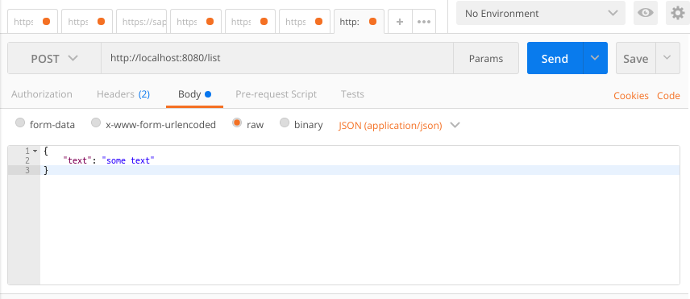

REST kontrolerių pridėjimas


Pridedame klasę

```
package com.example.demo;


import org.springframework.stereotype.Controller;
import org.springframework.web.bind.annotation.GetMapping;
import org.springframework.web.bind.annotation.RequestMapping;
import org.springframework.web.bind.annotation.ResponseBody;

@Controller
@RequestMapping
public class DemoController {


    @GetMapping("/time")
    @ResponseBody
    public long getTime() {
        return System.currentTimeMillis();
    }
}
```


Paleidžiame aplikaciją ir išbandome adresu http://localhost:8080/time


Pridedame sudėtingesnį endpointą:

Sukuriame `data transfer object` klasę: 
```
package com.example.demo;

public class Message {
    private String text;

    public String getText() {
        return text;
    }

    public void setText(String text) {
        this.text = text;
    }
}
```


```
List<Message> messageList = new ArrayList();
@PostMapping("/list")
@ResponseBody
public List<Message> messages(@RequestBody Message message) {
    messageList.add(message);
    return messageList;
}
```

Išbandome su Postman įrankiu



Užduotis: 

Eksperimentuoti su dabartine programa:
* Kaip atrodo klaidos pridedant kelis GET metodus tam pačiam adresui
* Kaip atrodo klaidos nuimant anotacijas @ResponseBody, @ResponseStatus
* Kaip atrodo klaidos jei data transfer object klasei ištrinsime metodus skirtus gauti laukams
* Kas atrodo klaidos "metant" Exception: `throw new RuntimeException()`
* Kaip atrodo klaidos siunčiant neteisingas užklausas - blogas kelias, blogas turinys

Išbandyti kitus endpointų tipus POST, GET, DELETE, PUT
